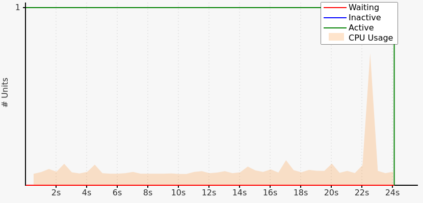

# Improving Compile Duration

To measure the compile duration in cargo, we will run cargo with the timings flag:

```bash
cargo build --timings
```

This will give some more details on what package takes how long. In addition, we will use the following commands to set up our project:

```bash
cargo new --bin test-compile-duration
cd test-compile-duration
cargo add --git https://github.com/robert-oleynik/tf-bindgen tf-bindgen
cargo add --git https://github.com/robert-oleynik/tf-kubernetes
```

We will use the `tf-kubernetes` provider because it is known for having long compile times. To finalize our preparations, we will add the following source code to our `src/main.rs`:

```rust
use tf_kubernetes::kubernetes::Kubernetes;
use tf_bindgen::Stack;

fn main() {
	let stack = Stack::new("compile-time");
	Kubernetes::create(&stack).build();
}
```

To start our tests, we will run `cargo build --timings` to receive an initial measurement for our repository. The following tables contain the result of this run:

| Unit                                             | Total  | Codegen      |
| ------------------------------------------------ | ------ | ------------ |
| tf-kubernetes v0.1.0                             | 160.4s | 110.3s (69%) |
| test-compile-time v0.1.0 bin "test-compile-time" | 24.7s  |              |
| tf-kubernetes v0.1.0 build script (run)          | 5.4s   |              |
| _Total_                                          | 206.3s |              |

Although `tf-kubernetes` has the longest compile time, we will focus on `test-compile-time`, because of incremental builds we only have to compile `tf-kubernetes` once. The following diagram contains the CPU usage for only the compilation `test-compile-time`:



Because our program is simple and short, we know most of this time is due to linking our executable. In addition, we can see that our linker is only using a single CPU core most of the time.

## Using `mold` as a linker

As stated on their GitHub page, “[mold](https://github.com/rui314/mold) is a faster drop-in replacement for existing Unix linkers. […] mold aims to enhance developer productivity by minimizing build, particularly in rapid debug-edit-rebuild cycles”. This matches our needs, so we will set mold as our linker in this section.

We will start with replacing our current linker with mold by adding `.cargo/config.toml` to our project:

```toml
# .cargo/config.toml
[target.x86_64-unknown-linux-gnu]
linker = "clang"
rustflags = ["-C", "link-arg=-fuse-ld=/usr/bin/mold"]
```

Now we can rerun our test using the following commands:

```sh
cargo clean # ensure same test conditions
cargo build --timings
```

While our total compile only drops by about 12%, the duration of building `test-compile-time` will be reduced by about 84%.

| Unit                                             | Total   | Codegen      |
| ------------------------------------------------ | ------- | ------------ |
| tf-kubernetes v0.1.0                             | 159.9s  | 111.0s (69%) |
| test-compile-time v0.1.0 bin "test-compile-time" | 3.9s    |              |
| tf-kubernetes v0.1.0 build script (run)          | 2.9s    |              |
| _Total_                                          | 180.37s |              |

## Using LLVM `lld` as a linker

While using `mold` gives you impressive performance, LLVM `lld` can reach the same level of in our case.

You can enable `lld` as your linker by setting your `.cargo/config.toml` to the following code:

```toml
# .cargo/config.toml
[target.x86_64-unknown-linux-gnu]
linker = "clang"
```

We will run the same commands as used with `mold`:

```sh
cargo clean # ensure same test conditions
cargo build --timings
```

The results show that we can see the same improvement in compile duration as with `mold`:

| Unit                                             | Total  | Codegen      |
| ------------------------------------------------ | ------ | ------------ |
| tf-kubernetes v0.1.0                             | 160.4s | 111.3s (69%) |
| test-compile-time v0.1.0 bin "test-compile-time" | 4.0s   |              |
| tf-kubernetes v0.1.0 build script (run)          | 2.9s   |              |
| _Total_                                          | 180.7s |              |
